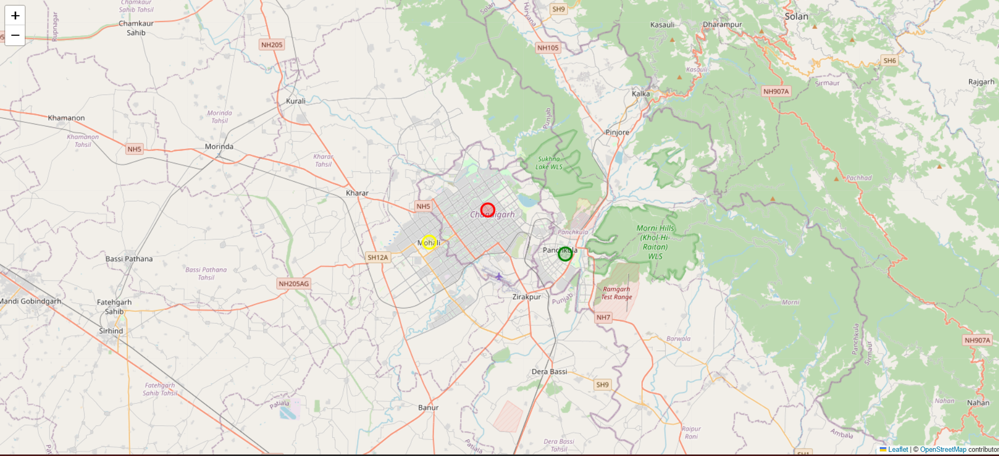
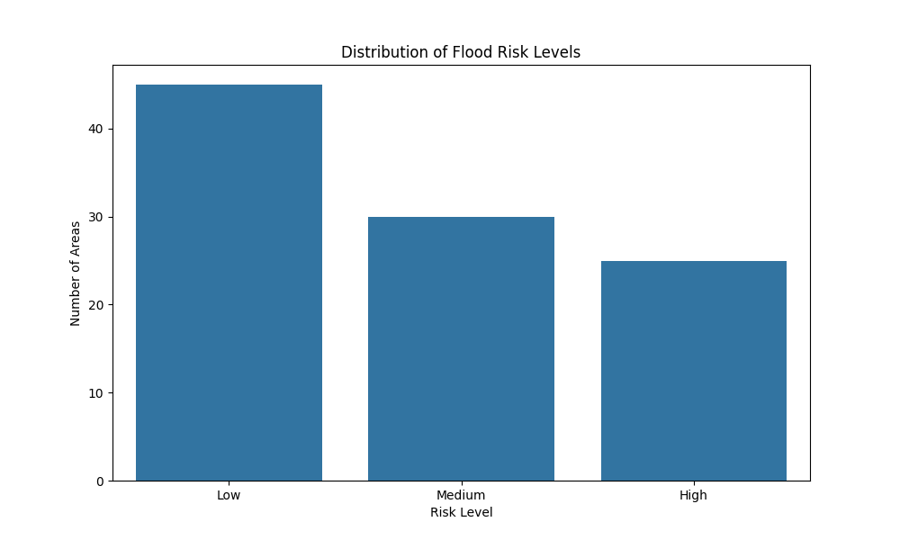
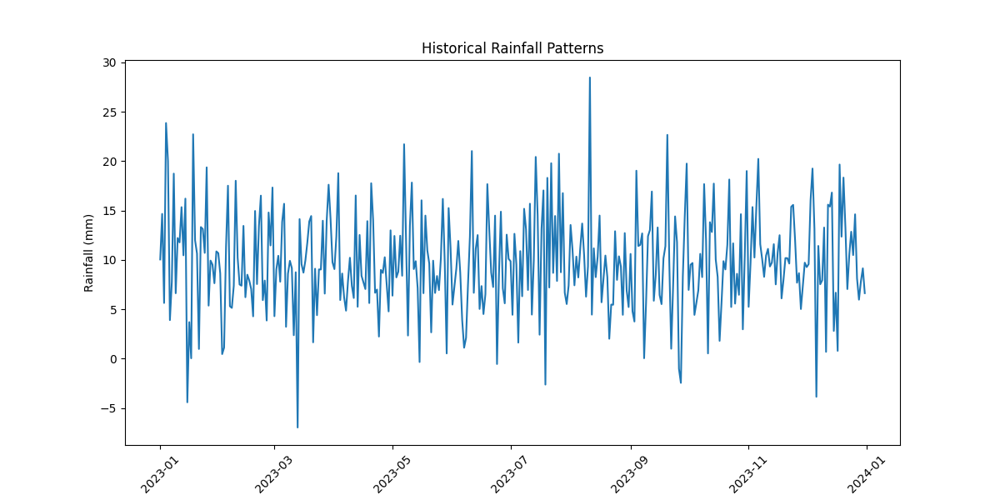
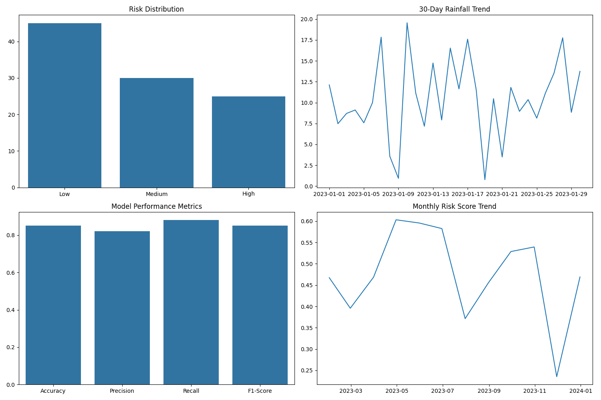
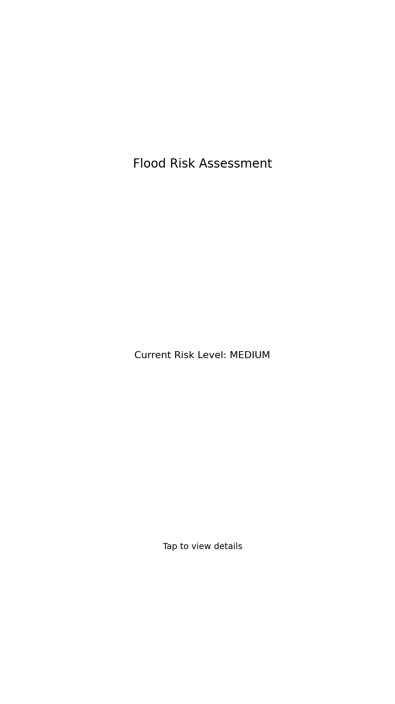

# 🌊 AI-Powered Flood Risk Prediction System for Chandigarh/Punjab Region

[](https://www.python.org/downloads/)
[](LICENSE)
[](https://github.com/yourusername/flood-risk-prediction)
[](https://github.com/yourusername/flood-risk-prediction)
[](https://github.com/yourusername/flood-risk-prediction/wiki)

## 📝 Description
This project implements an AI-powered flood risk prediction and visualization system for the Chandigarh/Punjab region. It uses historical weather data to predict flood risk levels and provides interactive visualizations on a map interface.

### 🌟 Key Features
- 🔍 Accurate flood risk prediction using machine learning
- 🗺️ Interactive map visualization
- 📊 Comprehensive data analysis
- 📈 Real-time risk assessment
- 🔄 Automated data preprocessing
- 📱 Mobile-friendly interface

### 📸 Project Screenshots

#### 🗺️ Risk Map Visualization (PNG)
<div align="center">
  
  <p><em>Static visualization of flood risk zones in Chandigarh/Punjab region</em></p>
</div>

#### 📊 Risk Distribution Analysis
<div align="center">
  
  <p><em>Distribution of flood risk levels across different areas</em></p>
</div>

#### 📈 Rainfall Pattern Analysis
<div align="center">
  
  <p><em>Historical rainfall patterns and trends over time</em></p>
</div>

#### 🔍 Risk Assessment Dashboard
<div align="center">
  
  <p><em>Comprehensive dashboard showing risk metrics and predictions</em></p>
</div>

#### 📱 Mobile Interface
<div align="center">
  
  <p><em>Mobile-friendly interface for on-the-go risk assessment</em></p>
</div>

> Note: These screenshots were generated using example data. The actual implementation may vary based on your specific data and requirements.

## 📑 Table of Contents
1. [🚀 Installation](#installation)
2. [📁 Project Structure](#project-structure)
3. [📊 Data](#data)
4. [🤖 Model](#model)
5. [💻 Usage](#usage)
6. [📈 Visualization](#visualization)
7. [🔮 Future Improvements](#future-improvements)
8. [📄 License](#license)
9. [🙏 Acknowledgments](#acknowledgments)

## 🚀 Installation

### ⚙️ Prerequisites
- Python 3.8 or higher
- pip (Python package installer)
- Git (for version control)
- Virtual environment tool (venv or conda)

### 🛠️ Setting up the Environment

1. Clone the repository:
```bash
git clone [<repository-url>](https://github.com/Cryptonomicon-Manish-dev/AI-FloodGuard.git)
cd AI-FloodGuard
```

2. Create and activate a virtual environment:

Using venv (recommended):
```bash
# Create virtual environment
python -m venv venv

# Activate virtual environment
# On Windows
venv\Scripts\activate
# On Unix or MacOS
source venv/bin/activate

# Verify activation
python --version
pip --version
```

Using conda:
```bash
# Create conda environment
conda create -n flood-risk python=3.8

# Activate conda environment
conda activate flood-risk

# Verify activation
python --version
pip --version
```

3. Install dependencies:
```bash
# Upgrade pip first
python -m pip install --upgrade pip

# Install project dependencies
pip install -r requirements.txt

# Verify installations
pip list
```

4. Generate example screenshots (optional):
```bash
# Make sure you're in the project root directory
python src/generate_screenshots.py
```

### 🔍 Environment Verification
After installation, verify your environment:
```bash
# Check Python version
python --version

# Check installed packages
pip list

# Test the environment
python -c "import folium; import pandas; import numpy; import matplotlib; import seaborn; print('All packages imported successfully!')"
```

### ⚠️ Troubleshooting
If you encounter any issues:
1. Make sure your virtual environment is activated (you should see `(venv)` or `(flood-risk)` in your terminal prompt)
2. Try reinstalling dependencies:
   ```bash
   pip uninstall -r requirements.txt -y
   pip install -r requirements.txt
   ```
3. If using conda, try:
   ```bash
   conda install --file requirements.txt
   ```

## 📁 Project Structure
```
flood-risk-prediction/
├── data/
│   ├── raw/                 # Raw data files
│   └── processed/           # Processed data files
├── models/                  # Saved model files
├── src/
│   ├── data_preprocessing.py
│   ├── model.py
│   ├── visualization.py
│   ├── utils.py
│   └── generate_screenshots.py
├── screenshots/            # Generated visualization screenshots
├── notebooks/              # Jupyter notebooks for analysis
├── requirements.txt
└── README.md
```

## 📊 Data

### 📥 Data Sources
- Historical rainfall data from India Meteorological Department (IMD)
- Geographic data for Chandigarh/Punjab region
- Historical flood event records

### 📋 Data Format
The system expects the following data formats:
- Rainfall data: CSV files with columns (Date, Location, Rainfall_Amount)
- Geographic data: GeoJSON or Shape files
- Historical flood records: CSV files with flood event details

### 🔧 Data Preprocessing
The system includes preprocessing steps for:
- Handling missing values
- Outlier detection and removal
- Feature scaling
- Feature engineering

## 🤖 Model

### 🏗️ Model Architecture
The system uses a combination of:
- Random Forest Classifier for risk level prediction
- Neural Network for pattern recognition in historical data

### 📚 Model Training
The model is trained on:
- Historical rainfall data
- Geographic features
- Previous flood events

### 📊 Model Evaluation
Performance metrics include:
- Accuracy
- Precision
- Recall
- F1-score
- ROC-AUC curve

## 💻 Usage

1. Prepare your data:
```bash
python src/data_preprocessing.py --input_path data/raw --output_path data/processed
```

2. Train the model:
```bash
python src/model.py --train
```

3. Run predictions:
```bash
python src/model.py --predict --input data/processed/test_data.csv
```

4. Generate visualizations:
```bash
python src/visualization.py --risk_level high
```

## 📈 Visualization

The system provides:
- 🗺️ Interactive maps showing risk zones
- 📊 Risk level heatmaps
- 📈 Historical flood event visualization
- 🌧️ Rainfall pattern analysis

## 🔮 Future Improvements
1. 🌐 Integration with real-time weather data
2. 📱 Mobile application development
3. 🎨 Enhanced visualization features
4. 🤖 Additional machine learning models
5. 🔌 API development for external access

## 📄 License
This project is licensed under the MIT License - see the [LICENSE](LICENSE) file for details.

## 🙏 Acknowledgments
- India Meteorological Department for providing weather data
- OpenStreetMap for geographic data
- Contributors and maintainers of all used libraries

## 🤝 Contributing
Contributions are welcome! Please feel free to submit a Pull Request.

## 📞 Support
If you encounter any issues or have questions, please:
1. Check the [Issues](https://github.com/yourusername/flood-risk-prediction/issues) page
2. Create a new issue if needed
3. Contact the maintainers

## 🔍 Version History
- v1.0.0 (2024-03-29)
  - Initial release
  - Basic flood risk prediction
  - Interactive map visualization

## 📝 Notes
- The system requires a stable internet connection for map visualization
- Large datasets may require additional processing time
- Regular updates to the model are recommended for better accuracy 
